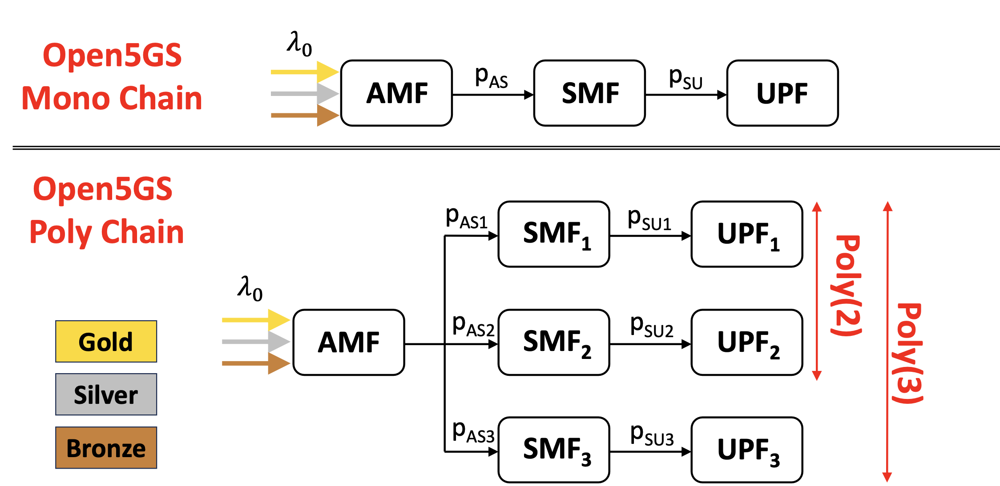

# Evaluate performance of 5G service chains

Here are the instructions for using Python code to evaluate the performance of 5G multi-class service chains.

A service chain (often known as a Service Function Chain - SFC) is a structure made up of virtualized nodes that must be traversed in a specific order to provide a given service.

This Python code allows you to evaluate the performance of an SFC-like structure composed of 5G core network nodes based on the Open5GS framework. The involved nodes include:

The Access and Mobility Management Function (AMF), responsible for managing access and mobility.
The Session Management Function (SMF), responsible for handling session establishment.
The User Plane Function (UPF), responsible for managing the data plane.
From an architectural perspective, we distinguish between (see figure below):

- 5G Mono chain: a 5G chain composed of a single path of nodes.
- 5G Poly chain: a 5G chain composed of multiple paths of nodes.

Both Mono and Poly deployments can be accessed by 5G user requests that belong to three different classes (gold, silver, bronze).
Moreover, each 5G node is connected to the other one via routing probability pij.

To evaluate the performance of Mono and Poly chain deployments, we provide several Python scripts available here: https://colab.research.google.com/drive/1kPTmzspRlJvsR55Tvwfb2vMHHIwqtKTM. 
The page contains three software components:

1) A customized parser that, when fed with logs produced by one of the Open5GS nodes (specifically, the AMF—the most critical node), returns the "average service time," which is the time taken by the AMF to manage the User Equipment (UE) registration procedure (simulated by the UERANSIM simulator) and the UE Protocol Data Unit (PDU) session establishment procedure.

2) A customized script to estimate the overall time (using the service time derived from the parsed logs) required for Registration and PDU session establishment for the Mono chain deployment.

3) A customized script to estimate the overall time (using the service time derived from the parsed logs) required for Registration and PDU session establishment for the Poly chain deployment.

Scripts 2) and 3) implement the concept of non-product-form queueing networks, specifically utilizing the Decomposition Algorithm. This approach is based on the principle of dividing a large system (the queue of nodes) into smaller subsystems that can be analyzed independently.
